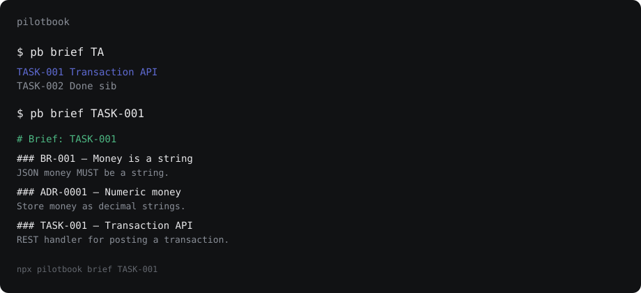

# Pilotbook

> Your repo has the chart. Pilotbook has the directions.



```bash
npx pilotbook brief TASK-001
```

```
# Brief: TASK-001

### BR-001 — Money is a string
_rule · business-rule · active_

JSON money MUST be a string. MUST NOT be a float.

### ADR-0001 — Numeric money
_adr · adr · accepted_

Store money as decimal strings.

### TASK-001 — Transaction API
_target · task · todo_
…
```

An agent that reads one task file will improvise the architecture. An agent that reads **the brief** gets the parent story, the epic, every linked business rule and accepted ADR, the `depends_on` chain, and a warning when a decision has been superseded — compiled, ordered by authority, under a token budget.

Plain markdown is the only source of truth. No event log, no SQLite, no server for the core loop. `pb lint` and `pb brief` are pure functions of files on disk.

```bash
npm i -g pilotbook
# or
npx pilotbook init
```

Daily driver is `pb` (same binary as `pilotbook`).

There are two loops. **Explore** turns a sentence into an epic and stories. **Ship** turns an unblocked task into verified code.

## Explore

Say "I want a dashboard" in Cursor or Claude Code. The **discover** skill should attach, then **shape**.

1. `pb similar "ops dashboard"` and `pb search dashboard --type idea,epic,story` — resume a live item instead of duplicating.
2. `pb new idea --title "Ops dashboard"` — fill Why, Jobs to be done, Personas, Sketch, Evidence, Open questions, Why not now.
3. `pb clarify IDEA-NNN` then `--answers` — gaps become criteria, a business-rule, or an open question.
4. `pb promote IDEA-NNN --to epic --title "Ops dashboard"` — never hand-edit `promoted_to`.
5. Shape creates stories with `pb new story --epic EPIC-NNN --title "..."`.
6. `pb lint` then `pb board`.

Worked session: [docs/explore.md](docs/explore.md). Step-by-step: [docs/getting-started.md](docs/getting-started.md).

## Ship

```bash
pb next
pb brief TASK-001
pb lint
pb ui          # loopback board
```

1. `pb next` — unblocked work, phase then priority.
2. `pb brief TASK-NNN` — parent story, epic, linked rules and ADRs.
3. Implement against the brief.
4. `pb verify TASK-NNN` then set `status: done`.
5. `pb lint` must exit 0. `pb board` refreshes `BOARD.md`.

Tab-complete real IDs:

```bash
pb completions zsh >> ~/.zshrc
pb brief TA<TAB>    # TASK-001  Transaction API
```

## Why this, not Backlog.md / AIPIM / Spec Kit

| | Backlog.md | AIPIM | Spec Kit | **Pilotbook** |
| --- | --- | --- | --- | --- |
| Markdown tasks in git | yes | derived from an event log | specs | **yes — only source of truth** |
| Business rules as typed entities | no | no | no | **yes, with edges from stories** |
| Compiled brief for an ID | no | stats + one task | constitution dump | **`pb brief`, authority-ordered** |
| Referential-integrity lint | weak | cycles only | no | **dangling / wrong-type / cycles / unknown fields, with file:line:col** |
| Verification of “done” | no | event-log gate | no | **content-hash in frontmatter, visible in the PR** |

## Commands

### Explore

| Command | What it does |
| --- | --- |
| `pb new idea --title "…"` | Capture a demand |
| `pb clarify <ID>` | Bounded questions; `--answers` writes back |
| `pb promote <ID> --to epic\|story` | Turn an idea into a work item |
| `pb reject <ID> --reason "…"` | Record a kill verdict |
| `pb similar <q>` | Rank items by token overlap |
| `pb search <q> --type idea,epic,story` | Substring search, optional type filter |

### Navigate

| Command | What it does |
| --- | --- |
| `pb explain <ID>` | Parent, children, blocked-by, blocks |
| `pb brief <ID>` | Context pack (`--budget`, `--format json`) |
| `pb next` | Unblocked work, phase then priority |
| `pb status [ID]` | Ready/blocked with requires, missingDeps, unlocks |
| `pb instructions [overview]` | List shipped skills (name + description) |
| `pb skill <name>` | Print one skill body (`--json` includes commands, writes, done) |

### Ship

| Command | What it does |
| --- | --- |
| `pb new <type> --title "…"` | Allocate the next ID |
| `pb verify <ID>` | Run `checks.commands`, stamp `verified`, parse `checks.report` into `results` |
| `pb lint` | Graph integrity (`--format github`) |
| `pb board` | Regenerate `BOARD.md` (`--dry-run` reports `in_sync`, added, orphans) |
| `pb converge <ID>` | Append tasks for uncovered criteria (`--dry-run` reports `converged` or a plan) |

### Graph

| Command | What it does |
| --- | --- |
| `pb init` | Config, directories, templates, agent skills |
| `pb analyze` | Coverage table with Proved?/Test for `ID#N` criteria; JSON `proved`/`unproven`/`provedPercent`; exit 1 for uncovered active rules or done stories with open children |
| `pb graph --dot` | Graphviz |
| `pb ui` | Kanban + graph + brief preview (127.0.0.1). Reloads when markdown on disk changes. |
| `pb mcp` | MCP server on stdio |
| `pb seed --from brief.md` | Materialize epics/stories/tasks |
| `pb export --to jira\|notion --dry-run` | One-way export |
| `pb manifest` | Write `.pb/graph.json` for `repo#ID` refs |
| `pb hook install` | Claude Code + Cursor session hooks |

Every command accepts `--json`. Operations live in `src/ops/`; the CLI, MCP server, and UI are thin adapters over the same functions.

## Config

```yaml
# pilotbook.config.yml
root: docs
types:
  epic:  { dir: backlog/epics,   prefix: EPIC-, pad: 3 }
  story: { dir: backlog/stories, prefix: US-,   pad: 3, parent: epic }
  task:  { dir: backlog/tasks,   prefix: TASK-, pad: 3, parent: story }
  adr:   { dir: adr,             prefix: ADR-,  pad: 4 }
  business-rule: { dir: business-rules, prefix: BR-, pad: 3 }
edges:
  depends_on:     { to: [epic, story, task], blocking: true, acyclic: true }
  business_rules: { to: [business-rule] }
  adrs:           { to: [adr] }
code_map:
  backend: [src]
checks:
  commands: [pnpm test, pnpm lint]
  report: .pb/junit.xml
hooks:
  block_on_unverified: false
  prime_budget: 6000
```

`checks.report` is an optional repo-relative JUnit XML path read after `checks.commands` run.
`pb verify --json` then carries `results` (`{name, classname, status, time}` per test) plus
`reportStale` when nothing rewrote the file. A missing or corrupt report is not an error — `results`
is simply empty.

`pb analyze --json` adds `proved` and `unproven` arrays of `{id, index, test?, status?}` plus
`provedPercent` (share of acceptance-criteria rows with a passing bound `ID#N` test).
`coveragePercent` still means "has a covering task" (US-015). Matching is the exact token `ID#N`
in JUnit `classname + " " + name`. fail, error, and skipped count as unproven. Rule and ADR rows
are not machine-ownable.

`hooks.prime_budget` is the token ceiling `pb hook session-start` compiles the in-progress brief
under. Truncation is reported as a `brief_truncated` warning, never dropped silently.

Discovery walks up from `cwd` for `pilotbook.config.yml`, then the git root.

## Skills

`pb init` installs skills into `.cursor/rules/`, `.cursor/skills/`, `.claude/skills/`, and `AGENTS.md` when those conventions exist: **discover**, **shape**, **implement**, **groom**, **prioritize**, **architect**. Cursor gets an always-apply rule (explore vs ship) plus each skill at `.cursor/skills/<name>/SKILL.md`.

## License

MIT
